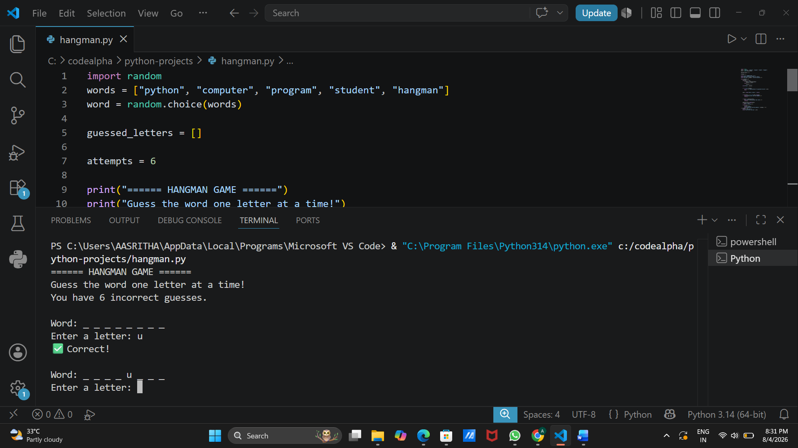

# Hangman Game in Python

## Project Title

**Hangman Game**

---

## Project Description

This project is a simple command-line implementation of the classic **Hangman Game** using Python. The program randomly selects a word from a predefined list, and the player has to guess the word one letter at a time. The player is given **6 incorrect attempts** to guess the word before the game ends.

The game validates user input, prevents duplicate guesses, and displays the player's progress after each attempt.

---

## Features

* Randomly selects a word from a predefined list.
* Allows the player to guess one letter at a time.
* Displays correctly guessed letters and hides unknown letters using underscores.
* Prevents duplicate letter guesses.
* Validates user input to ensure only one alphabet is entered.
* Gives the player 6 incorrect attempts.
* Displays a winning or losing message at the end of the game.

---

## Technologies Used

* **Programming Language:** Python 3
* **Library Used:**

  * `random` (built-in Python module)

---

## Installation Steps

1. Install **Python 3.x** on your computer.
2. Download or clone this project.
3. Save the Python file (e.g., `ex_hangman.py`) to your desired folder.
4. Open a terminal or command prompt.
5. Navigate to the project directory.

---

## How to Run the Project

Run the following command in the terminal:

```bash
python ex_hangaman.py
```

or

```bash
python3 ex_hangaman.py
```

### Sample Output

```
====== HANGMAN GAME ======
Guess the word one letter at a time!
You have 6 incorrect guesses.

Word: _ _ _ _ _ _ _

Enter a letter: p
✅ Correct!

Word: p _ _ _ _ _ _

Enter a letter: x
❌ Wrong!
Remaining incorrect guesses: 5
```

The game continues until:

* The player correctly guesses the word, or
* All 6 incorrect attempts are used.

---

## Project Structure

```
Hangman-Game/
│
├── ex_hangaman.py      # Main Python source code
├── README.md           # Project documentation
```

---

## Author Information

**Name:** Aasritha Ponugumati

**Course:** B.Tech – CSE (IoT)

**College:** RVR & JC College of Engineering

---

## License (Optional)

This project is developed for educational and learning purposes. It is free to use, modify, and distribute for academic and personal use.


## Screenshots
### Game Start


### Winning Screen


### Wrong Guess


### Gameplay

