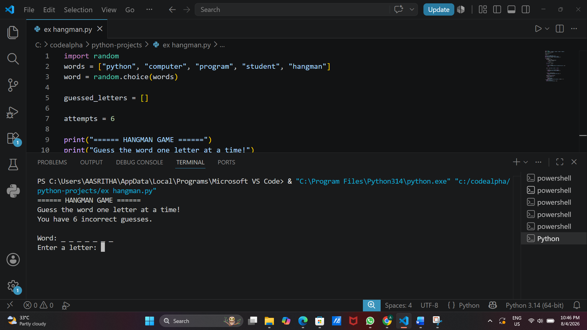
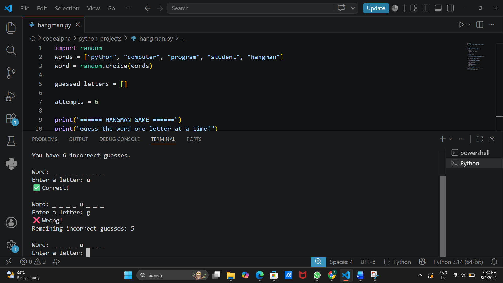

# Hangman-Game/

A simple command-line **Hangman** game built in Python. Guess the hidden word one letter at a time before you run out of attempts!

## 📌 About the Project

This is a beginner-friendly console-based Hangman game. The program randomly selects a word from a predefined list, and the player has to guess it letter by letter. The player has a limited number of incorrect guesses (6) before the game ends.

## 🎮 How It Works

1. The program randomly picks a word from a list of words.
2. The word is displayed as underscores (`_`), one for each letter.
3. The player enters one letter at a time.
4. If the letter is in the word, it is revealed in its correct position(s).
5. If the letter is not in the word, one attempt is deducted.
6. The game ends when:
   - The player guesses the full word correctly (**Win**), or
   - The player runs out of attempts (**Game Over**).

## 🛠️ Features

- Random word selection from a word list
- Tracks already guessed letters (no duplicate guesses)
- Input validation (only single alphabet characters allowed)
- Displays remaining incorrect guesses after each wrong attempt
- Simple, clean console output with emojis for feedback (✅ ❌ 🎉 😢)

## 📂 Word List

The current word list includes:

```
python, computer, program, student, hangman
```

You can easily add more words by editing the `words` list in the script.

## ▶️ How to Run

1. Make sure you have **Python 3** installed.
2. Clone this repository:
   ```bash
   git clone https://github.com/ponugumatiaasritha/CodeAlpha_HangmanGame.git
   cd CodeAlpha_HangmanGame
   ```
3. Run the script:
   ```bash
   python ex_hangaman.py
   ```
4. Follow the on-screen prompts to guess letters and try to win the game!

## 🖥️ Requirements

- Python 3.x
- No external libraries required (uses only the built-in `random` module)

## Screenshots

### Game Start


### Wrong Guess


### Gameplay


## 📄 License

This project is developed for educational and learning purposes. It is free to use, modify, and distribute for academic and personal use.
